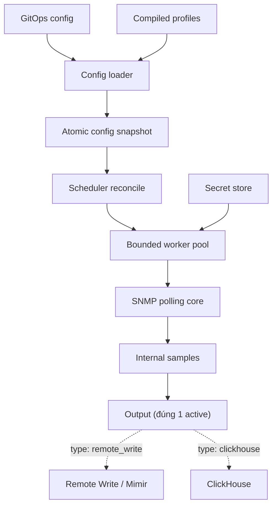

# SNMP Collector Implementation Specification

> Tài liệu nguồn (source of truth) để hướng dẫn coding agent xây dựng một SNMP collector chủ động dựa trên `prometheus/snmp_exporter`.

## 1. Mục tiêu

Xây dựng một dịch vụ Go tên tạm thời `snmp-collector` với các đặc tính:

- Tái sử dụng core SNMP ổn định của `prometheus/snmp_exporter`.
- Chủ động polling thiết bị theo interval, không cần HTTP request để kích hoạt.
- Quản lý device inventory và cấu hình bằng GitOps.
- Thêm, sửa, xóa device và profile bằng hot reload, không restart process.
- Dùng kho MIB và generator để compile MIB thành runtime profile.
- Hỗ trợ SNMP v1, v2c và v3 (`noAuthNoPriv`, `authNoPriv`, `authPriv`).
- Không lưu SNMP credential hoặc passphrase trực tiếp trong Git.
- Resolve credential qua abstraction `SecretStore`, trước mắt hỗ trợ environment/file cho development và HashiCorp Vault cho production.
- Chuẩn hóa kết quả polling thành internal sample model độc lập với output.
- Gửi dữ liệu tới đúng **một output đang active tại một thời điểm** — chọn giữa Prometheus Remote Write (Grafana Mimir) hoặc ClickHouse qua cấu hình (`output.type`), không chạy song song cả hai.
- Có HTTP server quản trị cho health và self-metrics, nhưng HTTP không được dùng để trigger polling.
- Có khả năng nhận bug fix từ upstream `snmp_exporter` với mức xung đột thấp.

## 2. Các quyết định bắt buộc

Coding agent phải tuân thủ các quyết định sau:

1. Đã fork đúng repository `prometheus/snmp_exporter`
2. Runtime collector không parse file MIB và không phụ thuộc Net-SNMP/CGO.
3. MIB chỉ được đọc bởi `mib-compiler`/generator trong CI hoặc một job riêng.
4. Device inventory và compiled profile phải hot reload; thêm device không được yêu cầu restart.
5. Không enqueue nhiều job cho cùng một device. Mỗi device có tối đa một poll đang chạy.
6. Config mới chỉ được activate sau khi parse và validate toàn bộ thành công.
7. Job đang chạy dùng immutable snapshot cũ; poll tiếp theo dùng snapshot mới.
8. Chỉ có đúng một output active tại một thời điểm (Remote Write/Mimir hoặc ClickHouse, chọn qua `output.type`); output chậm hoặc lỗi không được block polling worker.
9. Output delivery mặc định là at-least-once. Hệ thống phải chấp nhận khả năng duplicate khi retry.
10. Secret tuyệt đối không xuất hiện trong log, metric, error trả về HTTP hoặc config status.
11. Không tự động walk toàn bộ enterprise OID tree chỉ vì MIB tồn tại.
12. Giữ một HTTP endpoint `/metrics` để giám sát chính collector.
13. Code mỗi feature bao gồm test và phải tạo branch mới feat/[Tên feature]
## 3. Ngoài phạm vi phiên bản đầu

- Giao diện UI đầy đủ. (Tạm thời chưa cần)
- Tự động nhận diện chính xác mọi vendor/model/firmware.
- Exactly-once delivery xuyên suốt SNMP → ClickHouse/Mimir.
- Tự động tải MIB tùy ý từ Internet tại collector runtime. (Xem xét sau)
- Phân phối lại MIB vendor chưa xác minh license.
- Thực thi plugin nhị phân động bằng Go `plugin` package.

Plugin trong phiên bản đầu là interface Go và registry compile-time. 

## 4. Kiến trúc tổng thể



Luồng build profile:

```text
MIB files + source profile YAML
              |
              v
       generator/mib-compiler
              |
              v
 compiled profile bundle + manifest + checksum
              |
              v
       collector hot reload
```

## 5. Cấu trúc repository đề xuất (tối thiểu hóa refactor)

Nguyên tắc bắt buộc: **giữ nguyên layout phẳng hiện có của fork** (`main.go`, `collector/`, `config/`, `scraper/`, `generator/` ở root, không có `cmd/`/`internal/`/`pkg/`) để nhận bug fix từ upstream với xung đột thấp nhất. Chỉ thêm package mới ở root cho phần hoàn toàn chưa tồn tại; không di chuyển code hiện có sang layout khác chỉ vì lý do thẩm mỹ.

```text
snmp-collector/                 (fork của prometheus/snmp_exporter, layout giữ nguyên)
├── main.go                     # Giữ nguyên vị trí; sửa wiring để scheduler chủ động gọi poll thay vì chỉ scrape khi có HTTP request
├── collector/                  # Giữ nguyên; refactor Collect()/pduToSamples để trả về []sample.Sample thay vì prometheus.Metric
├── config/                     # Giữ nguyên; đây chính là "profile" model (module definitions trong snmp.yml)
├── scraper/                    # Giữ nguyên; đây chính là SNMP polling core (GET/GETBULK/WALK qua gosnmp) — bọc thêm interface Poller mỏng, không viết lại
├── generator/                  # Giữ nguyên; đây chính là mib-compiler, đã là binary riêng (generator/main.go)
│   ├── mibs/                   # Giữ nguyên; thêm manifest.yaml để track version/checksum/redistribution policy theo vendor
│   └── mib-patches/            # Giữ nguyên
├── scheduler/                  # MỚI: active polling scheduler, worker pool, no-overlap per device
├── inventory/                  # MỚI: device inventory loader + hot reload (tương đương config/ nhưng cho devices thay vì profiles)
├── sample/                     # MỚI: internal Sample model dùng chung giữa collector/ và output/
├── secrets/                    # MỚI: SecretStore interface + env/file (dev) và Vault (prod) backend
├── output/                     # MỚI: OutputManager chỉ giữ đúng 1 output active (chọn qua output.type)
│   ├── remotewrite/
│   └── clickhouse/
├── preflight/                  # MỚI: preflight/test API job manager
├── configs/                    # MỚI: file GitOps mẫu (collector.yaml, devices/, outputs.yaml) — chỉ thêm file, không đụng code
├── deploy/                     # MỚI: deployment manifest — upstream không có nên không xung đột
├── testdata/                   # Giữ nguyên
└── snmp-mixin/                 # Giữ nguyên (dashboards/alerts có sẵn)
```

So với phương án ban đầu, đã bỏ:

- **`cmd/`**: `main.go` ở root như upstream; chỉ có một binary chính, còn `generator/main.go` đã là binary compiler riêng — không cần layout multi-binary kiểu `cmd/`.
- **`internal/`**: bỏ hoàn toàn. Đây là service standalone, không phải library công khai cho project khác import, nên Go `internal/` visibility không mang lại giá trị, chỉ tạo thêm một lớp di chuyển thư mục không cần thiết.
- **`pkg/snmpcore`**: bỏ. `scraper/` + `collector/` hiện tại đã đúng vai trò SNMP polling core; không cần bọc thêm một package trừu tượng phía trên.
- **`mib-catalog/`, `profiles-src/`, `profiles-compiled/`**: bỏ, dùng lại `generator/mibs/`, `generator/mib-patches/`, `generator.yml` (nguồn) → `snmp.yml` (compiled, ở root) đã có sẵn từ upstream. Chỉ bổ sung `generator/mibs/manifest.yaml` cho metadata license/checksum (xem mục 11).
- **`internal/worker`, `internal/pipeline`**: gộp vào `scheduler/` và `output/` tương ứng thay vì tách thêm package riêng.
- **`internal/profile`**: không cần; profile snapshot dựng trực tiếp từ `config.Config` (đã có ở `config/`) mỗi lần hot reload.
- **`internal/adminhttp`**: không tách ngay; giữ handler trong `main.go` như hiện tại (upstream vốn đã wiring `net/http`/`/metrics` ở đó) cho đến khi phình to mới tách riêng — tránh refactor khi chưa cần.

Nguyên tắc merge upstream: không di chuyển code upstream hàng loạt nếu không cần thiết. Các gói hoàn toàn mới (`scheduler/`, `inventory/`, `sample/`, `secrets/`, `output/`, `preflight/`) không đụng tới code hiện có nên không tạo xung đột khi rebase/merge từ `prometheus/snmp_exporter`.

## 6. Phần tái sử dụng từ `snmp_exporter`

Giữ hoặc tách thành package độc lập các chức năng:

- Khởi tạo `gosnmp.GoSNMP`.
- SNMP v1/v2c/v3 authentication và transport.
- GET, GETBULK, WALK.
- Timeout, retries, max repetitions và unconnected UDP socket.
- Dynamic filter.
- PDU parsing.
- OID metric tree.
- Table index, lookup, enum, display hint và override.
- Counter32/Counter64/gauge/date/string handling.
- Các test hiện có liên quan đến parsing và scraping.

Các điểm phải refactor:

- `ScrapeTarget` phải trả về dữ liệu trung gian, không trả trực tiếp `prometheus.Metric`.
- Tách logic `pduToSamples` khỏi channel của `prometheus.Collector`.
- `collector.Collect()` không còn là entry point chính cho polling.
- HTTP `/snmp?target=...` có thể giữ ở compatibility mode, nhưng mặc định tắt và không tham gia scheduler.

API mục tiêu:

```go
type Poller interface {
    Poll(
        ctx context.Context,
        target TargetSnapshot,
        profile ProfileSnapshot,
        credentials Credentials,
    ) (PollResult, error)
}

type PollResult struct {
    Samples   []sample.Sample
    StartedAt time.Time
    EndedAt   time.Time
    Packets   uint64
    Retries   uint64
}
```

## 7. Internal sample model

Output không được phụ thuộc trực tiếp vào SNMP PDU hoặc `prometheus.Metric`.

```go
type MetricType string

const (
    MetricGauge   MetricType = "gauge"
    MetricCounter MetricType = "counter"
    MetricInfo    MetricType = "info"
)

type Sample struct {
    Name       string
    Value      float64
    Timestamp  int64 // Unix milliseconds.
    Labels     map[string]string
    Type       MetricType
    OID        string
    DeviceID   string
    PollID     string
}
```

Quy tắc:

- `Name`, `DeviceID`, `Timestamp` và `PollID` bắt buộc có.
- Mọi sample phải có các external label cấu hình trên device/site.
- Reserved label phải được validate.
- Với Remote Write, `Name` được chuyển thành label `__name__`.
- Với ClickHouse, `OID`, `Type` và `PollID` được giữ để điều tra và deduplicate.
- Không mutate `Labels` sau khi sample đã được gửi cho output.

## 8. Cấu hình GitOps (Phát triển sau)

### 8.1 Collector config

```yaml
apiVersion: snmpcollector.io/v1alpha1
kind: CollectorConfig

gitops:
  source: filesystem
  root: /etc/snmp-collector/config
  reconcileInterval: 30s

scheduler:
  workers: 100
  queueSize: 500
  defaultInterval: 60s
  defaultTimeout: 45s
  jitter: 10s
  maxBackoff: 15m

adminHTTP:
  listenAddress: 0.0.0.0:9199
  enableCompatibilitySNMPEndpoint: false
  preflight:
    enabled: true
    maxConcurrentTests: 5
    requestTimeout: 60s
    resultTTL: 15m
    allowedCIDRs:
      - 10.0.0.0/8
      - 172.16.0.0/12

profileDirectory: /etc/snmp-collector/profiles
```

Core collector chỉ cần hỗ trợ filesystem source trước. Git pull có thể do Git sidecar/init container/deployment pipeline đảm nhiệm. Loader theo dõi revision file hoặc content checksum, không cần chứa Git credential.

### 8.2 Device inventory

```yaml
apiVersion: snmpcollector.io/v1alpha1
kind: DeviceList

devices:
  - id: core-switch-01
    address: udp://10.10.10.1:161
    profile: cisco-catalyst@1.2.0
    credentialRef: vault://network-snmp/data/devices/core-switch-01
    interval: 60s
    timeout: 45s
    enabled: true
    labels:
      site: dc01
      vendor: cisco
      role: core
```

Validation bắt buộc:

- `id` duy nhất và ổn định.
- Address hợp lệ và không chứa credential.
- Profile tồn tại.
- Interval lớn hơn timeout hoặc có policy rõ ràng để skip overlap.
- Label name/value hợp lệ với Prometheus.
- Không cho phép label `__name__` từ device config.

### 8.3 Output config

Chỉ đúng một output active tại một thời điểm, chọn qua `output.type`. Block cấu hình của loại không active (nếu có mặt) bị bỏ qua hoàn toàn — không khởi tạo connection, không giữ tài nguyên.

```yaml
apiVersion: snmpcollector.io/v1alpha1
kind: OutputConfig

output:
  type: remote_write   # remote_write | clickhouse — đúng 1 giá trị active

  remoteWrite:
    endpoint: https://mimir.example.com/api/v1/push
    credentialRef: vault://monitoring/data/mimir/snmp-collector
    queue:
      capacity: 10000
      maxBatchSamples: 2000
      flushInterval: 2s
      overflowPolicy: drop_oldest

  clickhouse:
    dsnRef: vault://monitoring/data/clickhouse/snmp-collector
    database: monitoring
    table: snmp_metrics
    queue:
      capacity: 10000
      maxBatchSamples: 5000
      flushInterval: 3s
      overflowPolicy: drop_oldest
```

Đổi `output.type` (ví dụ từ `remote_write` sang `clickhouse`) là một thay đổi hot-reload bình thường — xem hành vi diff ở mục 9.

## 9. Hot reload và reconciliation

Config manager phải triển khai state machine:

```text
Detect revision
    -> Load all files
    -> Parse
    -> Resolve references
    -> Validate
    -> Build immutable snapshot
    -> Calculate diff
    -> Atomic publish
    -> Scheduler/output reconcile
```

Nếu bất kỳ bước nào lỗi:

- Không publish snapshot mới.
- Giữ nguyên last-known-good snapshot.
- Tăng metric reload failure.
- Log error không chứa secret.

Interface:

```go
type ConfigSnapshot struct {
    Revision string
    Devices  map[string]DeviceSnapshot
    Profiles map[string]ProfileSnapshot
    Output   OutputSnapshot // đúng 1 output active, không phải map
}

type Reconciler interface {
    Reconcile(ctx context.Context, oldCfg, newCfg *ConfigSnapshot) error
}
```

Hành vi diff:

| Thay đổi | Hành vi |
| --- | --- |
| Add device | Tạo state và schedule poll đầu tiên có jitter |
| Update address/interval/profile | Reschedule; poll tiếp theo dùng snapshot mới |
| Disable/delete device | Không tạo job mới; tùy policy có thể cancel job hiện tại |
| Add/update profile | Atomically publish profile; reschedule device liên quan |
| Output config đổi (endpoint hoặc `type`) | Khởi tạo output mới, kiểm tra readiness; flush + close output cũ theo deadline; sau đó swap con trỏ active |
| Config lỗi | Giữ last-known-good |

Không lock global scheduler trong suốt quá trình I/O hoặc polling.

## 10. Scheduler và worker pool

Không dùng mô hình mỗi ticker enqueue một job vô điều kiện.

State mỗi device:

```go
type DeviceState struct {
    DeviceID       string
    NextRun        time.Time
    Running        bool
    FailureCount   uint32
    LastStartedAt  time.Time
    LastFinishedAt time.Time
}
```

Yêu cầu:

- Timing structure dùng min-heap hoặc timing wheel; chỉ có một entry kế tiếp cho mỗi device.
- Worker pool và ready queue có giới hạn.
- Không cho phép hai poll đồng thời trên cùng device.
- Nếu device đến hạn nhưng đang chạy: skip/coalesce, không enqueue thêm.
- Queue đầy: không block vô hạn; reschedule với delay ngắn và tăng metric.
- Poll có context timeout.
- Failure dùng exponential backoff có jitter và max cap.
- Success reset failure count.
- Graceful shutdown: ngừng schedule job mới, chờ job đang chạy theo deadline, flush output.
- Hỗ trợ concurrency limit toàn cục và tùy chọn theo site/vendor/subnet.

Công thức capacity tham khảo:

```text
minimum_workers ~= device_count * average_poll_duration / poll_interval
```

Metric bắt buộc:

- `snmpcollector_scheduler_queue_depth`
- `snmpcollector_scheduler_poll_skipped_total{reason}`
- `snmpcollector_worker_active`
- `snmpcollector_poll_duration_seconds{device,profile}` (cân nhắc cardinality)
- `snmpcollector_poll_total{status,profile}`
- `snmpcollector_snmp_packets_total`
- `snmpcollector_snmp_retries_total`

Không đưa passphrase, IP nhạy cảm hoặc arbitrary error string vào label.

## 11. MIB catalog và compiler

### 11.1 Nguyên tắc

- Dùng lại `generator/` hiện có làm mib-compiler; không tạo thư mục `mib-catalog/` song song.
- `generator/mibs/` là file catalog, không phải runtime database/service.
- Không tuyên bố catalog "đầy đủ".
- MIB chuẩn/vendor được lưu và tải về theo đúng cơ chế `generator/Makefile` hiện tại (biến `*_URL`, license cho phép mới commit).
- MIB vendor phải có metadata nguồn, version, checksum và redistribution policy — bổ sung một file `generator/mibs/manifest.yaml`, không cần cấu trúc thư mục mới.
- MIB không rõ license có thể được download trong private CI (như hiện tại) nhưng không tự động redistribute.

Thay đổi tối thiểu so với hiện tại — chỉ thêm một file:

```text
generator/
├── generator.yml        # Giữ nguyên: source profile (module definitions)
├── mibs/
│   └── manifest.yaml    # MỚI: version, source URL, sha256, redistribution theo từng MIB/package
├── mib-patches/         # Giữ nguyên
└── main.go              # Giữ nguyên: entrypoint compiler
```

Manifest tối thiểu:

```yaml
packages:
  - name: cisco-catalyst-9000
    version: "2026.01"
    source: https://example.invalid/vendor-package.zip
    sha256: "replace-with-real-checksum"
    redistribution: false
    mibFiles:
      - CISCO-SMI.my
      - CISCO-CATALYST-9000-MIB.my
```

### 11.2 Compiler behavior

Dùng lại binary `generator` hiện có (build từ `generator/main.go`, lệnh `generate` đã tồn tại), không tạo binary `mib-compiler` mới:

```bash
cd generator
go run . generate \
  --mibs-dir mibs \
  -g generator.yml \
  -o ../snmp.yml
```

Compiler phải:

- Fail khi có parse error nghiêm trọng hoặc missing import.
- Resolve symbolic name thành numeric OID.
- Sinh metric type, description/help, index, lookup và enum.
- Minimize redundant OID walks.
- Phân biệt scalar GET `.0`, instance GET và subtree WALK.
- Output deterministic để diff Git ổn định.
- Ghi version/source revision/MIB list/checksum liên quan vào `generator/mibs/manifest.yaml`.
- Không publish `snmp.yml` mới nếu validation/test thất bại.

### 11.3 Hot add MIB/profile

```text
Commit MIB + module mới trong generator.yml
    -> CI compile (go run . generate)
    -> test against fixture/device lab
    -> commit snmp.yml mới
    -> GitOps sync snmp.yml
    -> collector validates
    -> atomic hot reload
```

Collector không restart. Job đang chạy dùng profile cũ; poll tiếp theo dùng profile mới.

Nếu cần thử nhanh numeric OID khi chưa có MIB, cho phép `generator.yml` khai báo metric thủ công, nhưng bắt buộc cung cấp name/type/index metadata.

## 12. SecretStore và Vault

Interface:

```go
type SecretStore interface {
    Resolve(ctx context.Context, ref string) (Secret, error)
    Invalidate(ref string)
    Close() error
}
```

Credential model:

```go
type Credentials struct {
    Version       int
    Community     SecretString
    Username      string
    SecurityLevel string
    AuthProtocol  string
    AuthPassword  SecretString
    PrivProtocol  string
    PrivPassword  SecretString
    ContextName   string
}
```

Vault requirements:

- Hỗ trợ KV v2 trước.
- Hỗ trợ Kubernetes Auth hoặc AppRole; token tĩnh chỉ dành cho development.
- Vault policy least privilege theo path.
- Cache secret trong memory có TTL.
- Renew token/lease khi phù hợp.
- Khi `credentialRef` thay đổi, invalidate cache cũ.
- Secret rotation phải có hiệu lực mà không restart collector.
- Nếu Vault tạm thời lỗi, có thể dùng secret cache chưa hết policy TTL; khi hết TTL phải fail closed theo cấu hình.
- Redact type phải implement `String()`/`GoString()` không lộ giá trị.
- Không serialize resolved secret trở lại config snapshot/status.

## 13. Output abstraction (đúng một active)

```go
type Output interface {
    ID() string
    Start(ctx context.Context) error
    Write(ctx context.Context, batch []sample.Sample) error
    Flush(ctx context.Context) error
    Ready() error
    Close(ctx context.Context) error
}

type OutputManager struct {
    active Output // luôn đúng 1 instance — không phải registry/danh sách nhiều output
}
```

Pipeline phải copy hoặc freeze batch trước khi gửi cho output, vì output ghi bất đồng bộ trong khi polling goroutine có thể tái sử dụng buffer. Output active có:

- Queue riêng (in-memory, bounded).
- Batch policy riêng.
- Retry/backoff riêng.
- Circuit breaker/readiness riêng.
- Overflow policy rõ ràng (drop khi queue đầy).

Không cho phép nhiều output cùng active. Khi đổi `output.type` (Mimir ↔ ClickHouse): khởi tạo output mới và kiểm tra `Ready()`, `Flush()` + `Close()` output cũ theo deadline, rồi mới swap `OutputManager.active` — polling worker không bị block trong lúc chuyển đổi.

## 14. Remote Write output cho Mimir

Yêu cầu:

- Chuyển sample thành Prometheus time series.
- Dùng label `__name__` cho metric name.
- Sort/deduplicate label set để fingerprint ổn định.
- Batch theo số sample và thời gian.
- Sử dụng implementation/protocol library tương thích Prometheus Remote Write; không tự phát minh wire format.
- Hỗ trợ authentication header qua SecretStore.
- Retry network error, HTTP 429 và lỗi 5xx với exponential backoff.
- Không retry vĩnh viễn lỗi cấu hình 4xx không transient.
- Có timeout và max in-flight requests.

Metric:

- `snmpcollector_output_samples_total{output,status}`
- `snmpcollector_output_queue_depth{output}`
- `snmpcollector_output_retries_total{output}`
- `snmpcollector_output_dropped_total{output,reason}`
- `snmpcollector_output_last_success_timestamp_seconds{output}`

## 15. ClickHouse output

Batch insert, không insert từng sample.

Schema tham khảo:

```sql
CREATE TABLE monitoring.snmp_metrics
(
    timestamp DateTime64(3, 'UTC'),
    device LowCardinality(String),
    metric LowCardinality(String),
    value Float64,
    metric_type LowCardinality(String),
    labels Map(String, String),
    oid String,
    poll_id UUID,
    ingested_at DateTime64(3, 'UTC') DEFAULT now64(3)
)
ENGINE = MergeTree
PARTITION BY toYYYYMM(timestamp)
ORDER BY (metric, device, timestamp, poll_id);
```

Yêu cầu:

- Dùng native/proven ClickHouse Go client.
- Batch theo `maxBatchSamples` hoặc `flushInterval`.
- Retry transient network/server failures.
- Credential/DSN lấy từ SecretStore.
- Dùng UTC trong storage; presentation timezone xử lý ở query/dashboard.
- At-least-once nghĩa là duplicate có thể xuất hiện; giữ `poll_id` để nhận diện.

## 16. Admin HTTP server

Endpoint mặc định:

```text
GET /metrics
GET /healthz
GET /readyz
GET /config/status
POST /api/v1/preflight/tests
GET /api/v1/preflight/tests/{testID}
DELETE /api/v1/preflight/tests/{testID}
```

Semantics:

- `/healthz`: process/event loop còn sống.
- `/readyz`: có valid config snapshot, scheduler chạy và output bắt buộc đã ready theo policy.
- `/config/status`: revision, thời gian reload, số device/profile/output và lỗi reload đã redact.
- `/metrics`: collector self-metrics.
- Không expose resolved credentials.
- Không có endpoint trigger polling mặc định.
- Compatibility `/snmp` nếu giữ lại phải opt-in và giới hạn rõ tài nguyên.

### 16.1 Preflight/Test API trước khi add device

Phải có API read-only để người vận hành hoặc UI kiểm tra thiết bị trước khi commit device vào GitOps. Đây là luồng kiểm thử tạm thời, không phải polling production và không được tự động thêm device vào scheduler.

```text
Nhập target + profile + credentialRef
              |
              v
       Static validation
              |
              v
     SNMP connectivity/auth test
              |
              v
      Limited profile test poll
              |
              v
   Redacted result + sample preview
              |
              v
 Người dùng quyết định commit GitOps
```

Do SNMP WALK có thể mất nhiều thời gian, API dùng asynchronous job:

```http
POST /api/v1/preflight/tests
Content-Type: application/json

{
  "target": "udp://10.10.10.1:161",
  "profile": "cisco-catalyst@1.2.0",
  "credentialRef": "vault://network-snmp/data/devices/core-switch-01",
  "timeout": "45s",
  "mode": "profile",
  "samplePreviewLimit": 50
}
```

Response:

```http
HTTP/1.1 202 Accepted

{
  "testID": "01J...",
  "status": "queued",
  "expiresAt": "2026-07-20T10:15:00Z"
}
```

Đọc kết quả:

```http
GET /api/v1/preflight/tests/01J...
```

```json
{
  "testID": "01J...",
  "status": "succeeded",
  "target": "udp://10.10.10.1:161",
  "profile": "cisco-catalyst@1.2.0",
  "checks": {
    "configValid": true,
    "targetAllowed": true,
    "secretResolved": true,
    "snmpReachable": true,
    "authenticationSucceeded": true,
    "profileCompatible": true
  },
  "deviceIdentity": {
    "sysName": "core-switch-01",
    "sysObjectID": "1.3.6.1.4.1.9.1.1745",
    "sysDescr": "redacted-or-truncated-preview"
  },
  "poll": {
    "durationMs": 1240,
    "packets": 12,
    "retries": 0,
    "configuredMetrics": 140,
    "returnedMetrics": 132,
    "unsupportedMetrics": 8
  },
  "samplePreview": [
    {
      "name": "sysUpTime",
      "value": 123456,
      "labels": {}
    }
  ],
  "warnings": [],
  "recommendation": "ready_to_add"
}
```

Mode hỗ trợ:

| Mode | Mục đích |
| --- | --- |
| `validate` | Chỉ parse request, kiểm tra target/profile/reference; không gửi packet |
| `connectivity` | Kiểm tra resolve secret và SNMP GET tối thiểu như `sysObjectID.0`, `sysName.0` |
| `profile` | Thực hiện poll giới hạn theo compiled profile và trả compatibility summary |

Quy tắc bắt buộc:

- Preflight dùng cùng `Poller`, profile loader và SecretStore với production để tránh hai implementation khác nhau.
- Job preflight chạy trên worker pool riêng và semaphore riêng; không được chiếm hết production polling workers.
- Không đưa sample preflight vào output queue, Mimir hoặc ClickHouse.
- Không tạo `DeviceState`, không gọi scheduler `Add()` và không sửa Git.
- Chỉ nhận `credentialRef`; không nhận passphrase plaintext trong request production.
- Kết quả chỉ lưu trong memory có TTL; restart có thể làm mất test result.
- Preview bị giới hạn số sample, số label, độ dài string và tổng response size.
- `sysDescr`, string-valued OID và error detail phải truncate/redact theo policy.
- Hỗ trợ cancel job bằng `DELETE`; cancellation truyền xuống `context.Context` của Poller.
- Request timeout có hard maximum từ server, client không được tăng vượt giới hạn.
- Trả error code có cấu trúc, ví dụ `CONFIG_INVALID`, `TARGET_DENIED`, `SECRET_RESOLUTION_FAILED`, `SNMP_TIMEOUT`, `SNMP_AUTH_FAILED`, `PROFILE_INCOMPATIBLE`.
- Không trả raw Vault error, token, community, auth password, priv password hoặc Authorization header.

### 16.2 Bảo mật Preflight API

API này có khả năng gửi UDP/TCP tới target tùy chọn nên có rủi ro bị dùng làm network scanner hoặc SSRF. Production bắt buộc có:

- Authentication và authorization; role tối thiểu `snmp-preflight:execute` và `snmp-preflight:read`.
- Target CIDR allowlist và denylist; deny loopback, link-local, metadata endpoints và subnet không được quản lý theo mặc định.
- DNS resolution policy chống DNS rebinding; resolve và kiểm tra toàn bộ IP trước khi connect.
- Rate limit theo principal và global concurrency limit.
- Audit log gồm principal, target, profile, test ID và outcome; không chứa secret.
- Request/response size limit.
- Test result chỉ người tạo hoặc operator được đọc, trừ khi policy quy định khác.
- TLS cho API ở production hoặc đặt sau authenticated reverse proxy.

Metric:

- `snmpcollector_preflight_active`
- `snmpcollector_preflight_total{mode,status}`
- `snmpcollector_preflight_duration_seconds{mode,status}`
- `snmpcollector_preflight_rejected_total{reason}`

### 16.3 Quan hệ với GitOps/UI

Preflight API chỉ xác nhận khả năng thu thập tại thời điểm test. Sau khi thành công, UI hoặc operator tạo device manifest/PR riêng:

```text
Preflight succeeded
    -> Render/review device YAML
    -> Commit/PR GitOps
    -> Merge
    -> Collector reconciliation
    -> Production polling
```

Không thêm endpoint `POST /devices` trực tiếp vào scheduler trong phiên bản đầu vì sẽ tạo hai source of truth giữa API state và Git.

## 17. Reliability và backpressure

Hệ thống không dùng WAL. Chấp nhận mất sample khi downstream unavailable hoặc khi collector restart với dữ liệu còn trong queue; đổi lại tránh được chi phí vận hành và độ phức tạp của durable storage. Phải định nghĩa rõ khi downstream unavailable:

1. Poller tiếp tục polling độc lập với trạng thái output queue; polling không bị pause vì output chậm/lỗi.
2. Output đang active có RAM queue bounded (`capacity` trong config); không được tăng không giới hạn.
3. Khi queue đạt warning watermark: tăng metric cảnh báo.
4. Khi queue đầy: áp dụng `overflowPolicy` cấu hình (`drop_oldest` mặc định); sample bị drop tăng `snmpcollector_output_dropped_total{output,reason="queue_full"}`.
5. Shutdown flush queue hiện có theo deadline; phần chưa gửi khi hết deadline bị drop, không cố gắng lưu lại.

Failure isolation:

- Output đang active (Mimir hoặc ClickHouse) lỗi/chậm không được block polling worker.
- Một device timeout không chiếm worker vô hạn.
- Một profile lỗi khi reload không phá last-known-good snapshot.
- Vault lỗi không được làm lộ secret cache hoặc panic toàn process.

## 18. Observability

Log structured JSON, có các field:

```text
component, device_id, profile, poll_id, output_id, revision, duration, status
```

Không log:

- Community string.
- SNMPv3 auth/priv password.
- Vault token.
- Authorization header.
- DSN có password.

Metric nên tránh cardinality quá cao. Metric per-device có thể opt-in; mặc định ưu tiên aggregate theo profile/site/status. Cung cấp diagnostic log hoặc bounded status API cho lỗi device cụ thể.

## 19. Security

- SNMP v1/v2c được đánh dấu insecure; tài liệu khuyến nghị SNMPv3 authPriv.
- Hỗ trợ SHA family/AES theo khả năng `gosnmp` và upstream config.
- Config file không chứa plaintext secret production.
- Runtime filesystem permission tối thiểu.
- Container chạy non-root nếu có thể.
- TLS verify bật mặc định cho Vault, Mimir và ClickHouse.
- Không có `insecureSkipVerify` mặc định; nếu hỗ trợ phải có warning metric/log.
- Validate address để giảm SSRF/misconfiguration nếu sau này có API/UI.
- Giữ `LICENSE`/`NOTICE` theo Apache-2.0 của upstream và ghi nhận modifications.

## 20. Test strategy

### Unit tests

- Config parse/validate.
- Snapshot diff.
- Add/update/delete/disable device reconciliation.
- Scheduler không overlap cùng device.
- Queue full behavior.
- Backoff và jitter với clock giả.
- PDU → internal sample mapping.
- Label sanitization.
- Secret redaction.
- Output retry classification.
- Queue overflow/drop policy.
- Preflight request validation và structured error mapping.
- CIDR allowlist/denylist, DNS rebinding defense và rate limiting.
- Sample preview truncation/redaction.
- Preflight cancellation và result TTL cleanup.

### Integration tests

- SNMP simulator cho v2c và v3 authNoPriv/authPriv.
- Thêm device qua file GitOps và xác nhận poll bắt đầu không restart.
- Đổi interval và xác nhận reschedule.
- Xóa device và xác nhận không có job mới.
- Publish profile mới và xác nhận poll tiếp theo dùng OID mới.
- Profile lỗi và xác nhận last-known-good vẫn hoạt động.
- Vault test container: read, rotate và revoke credential.
- Mimir/remote-write receiver fixture.
- ClickHouse container và batch insert.
- Ngắt output đang active để xác nhận polling không bị block.
- Đổi `output.type` (remote_write ↔ clickhouse) qua hot reload: xác nhận output cũ được flush/close, output mới nhận sample tiếp theo, device state/scheduler không bị gián đoạn.
- Preflight v2c và v3 qua simulator nhưng không tạo scheduler state hoặc output sample.
- Preflight sai credential trả `SNMP_AUTH_FAILED` và không lộ secret.
- Preflight target ngoài allowlist bị từ chối trước khi gửi network packet.
- Preflight profile mới trả compatibility summary trước khi device được add.

### Load tests

- Ít nhất 1.000 simulated devices.
- Device latency hỗn hợp và timeout burst.
- Queue bounded dưới downstream outage; drop rate quan sát được qua metric.
- Không goroutine leak qua nhiều lần config reload.
- Không tăng số scheduled entries theo số tick; phải xấp xỉ số device.

## 21. Acceptance criteria

Phiên bản đầu chỉ được coi là hoàn thành khi:

- [ ] Polling chủ động theo interval hoạt động mà không gọi `/snmp`.
- [ ] Thêm device bằng config tạo polling mới trong thời gian reconcile mà không restart.
- [ ] Update/delete/disable device hoạt động không restart.
- [ ] Không có concurrent poll trùng device.
- [ ] Queue và RAM bounded.
- [ ] Có ít nhất SNMP v2c và v3 authPriv integration test.
- [ ] MIB compiler sinh deterministic compiled profile.
- [ ] Thêm compiled profile mới được hot reload.
- [ ] Config/profile lỗi giữ last-known-good.
- [ ] Vault rotation có hiệu lực không restart.
- [ ] Remote Write gửi được sample tới compatible receiver/Mimir.
- [ ] ClickHouse batch insert hoạt động.
- [ ] Output đang active có retry; output lỗi/chậm không block polling worker.
- [ ] Đổi `output.type` (Mimir ↔ ClickHouse) qua hot reload không cần restart và không gián đoạn polling.
- [ ] `/metrics`, `/healthz`, `/readyz`, `/config/status` hoạt động.
- [ ] Preflight API kiểm tra static config, connectivity/authentication và limited profile poll.
- [ ] Preflight không add device và không gửi sample tới output.
- [ ] Preflight có authentication/authorization, target allowlist, rate limit và concurrency limit.
- [ ] Kết quả preflight được redact, bounded và tự hết hạn.
- [ ] Không secret nào xuất hiện trong log và status test fixtures.
- [ ] Có benchmark/load test và tài liệu sizing worker.

## 22. Kế hoạch triển khai theo phase

### Phase 0 — Upstream baseline

- Fork `prometheus/snmp_exporter`.
- Thêm upstream remote và ghi quy trình sync.
- Chạy toàn bộ test upstream trước khi sửa.
- Ghi lại upstream commit/tag làm baseline.

### Phase 1 — Extract polling core

- Tách target/profile/credential model.
- Refactor scrape result thành internal samples.
- Giữ compatibility exporter test nếu khả thi.
- Không xây scheduler trước khi core có API và tests độc lập.

### Phase 1.5 — SecretStore interface + dev backend

- Định nghĩa interface `SecretStore` (mục 12).
- Backend development: environment variable / file — chưa cần Vault.
- Redaction test cho secret-bearing type (`String()`/`GoString()` không lộ giá trị).

### Phase 2 — Active scheduler

- Implement device inventory filesystem loader.
- Implement min-heap scheduler, bounded worker pool, timeout và no-overlap.
- Scheduler resolve credential qua `SecretStore` (dev backend từ Phase 1.5) trước khi gọi `Poller.Poll()`.
- Thêm self-metrics và graceful shutdown.

### Phase 3 — Hot reload/GitOps

- Implement immutable snapshot, validation và reconciliation — chỉ phần `Devices` trong `ConfigSnapshot` (mục 9); phần `Profiles` bổ sung ở Phase 4, phần `Output` bổ sung ở Phase 6.
- Add/update/delete device không restart.
- Last-known-good và config revision status.

### Phase 3.5 — Preflight/Test API

- Implement async preflight job manager và bounded result store có TTL.
- Tái sử dụng production Poller/ProfileStore/SecretStore nhưng dùng worker pool riêng.
- Implement `validate`, `connectivity` và `profile` modes.
- Thêm authentication hook, authorization, target allowlist, rate limit, cancellation và audit log.
- Chứng minh preflight không mutate scheduler, GitOps state hoặc output đang active.

### Phase 4 — Profile/MIB pipeline

- Bổ sung `generator/mibs/manifest.yaml` (version, checksum, redistribution) cho `generator/` hiện có; không đóng gói binary mới.
- Hot reload `snmp.yml` khi thay đổi — hoàn thiện phần `Profiles` còn thiếu trong `Reconciler`/`ConfigSnapshot` từ Phase 3.
- CI validation và deterministic output test cho `generator generate`.

### Phase 5 — Vault production backend

- Vault KV v2, auth (Kubernetes Auth/AppRole), cache, renew, rotation.
- Fail-closed khi hết TTL cache và Vault vẫn lỗi.
- Redaction test riêng cho backend Vault (không lộ token/lease).

### Phase 6 — Outputs

- `OutputManager` giữ đúng 1 output active (chọn qua `output.type`), không phải registry nhiều output song song.
- Remote Write/Mimir.
- ClickHouse batching.
- Hot-swap output khi `output.type` đổi (flush + close cũ, readiness-check rồi start mới).
- Retry/backoff và metrics.

### Phase 7 — Reliability/backpressure hardening

- Bounded RAM queue overflow policy (drop_oldest) cho output đang active.
- Chứng minh output lỗi/chậm không block polling worker (không còn "failure isolation giữa 2 output" vì chỉ có 1 output active).
- Load tests.

### Phase 8 — Production hardening

- Security review.
- Resource limits và performance profile.
- Upgrade/sync upstream process.
- Deployment examples, dashboards và runbook.

## 23. Coding-agent operating instructions

Khi dùng tài liệu này làm prompt cho coding agent:

1. Trước mỗi phase, agent phải inspect repository và viết plan ngắn theo đúng phase.
2. Không triển khai nhiều phase lớn trong một commit.
3. Không sửa API upstream rộng hơn mức cần thiết.
4. Mọi concurrency behavior phải có test với fake clock hoặc deterministic synchronization; tránh test dựa vào `time.Sleep` dài.
5. Mọi queue/channel phải có capacity hoặc lý do rõ ràng nếu unbuffered.
6. Mọi goroutine phải có owner, cancellation path và shutdown test.
7. Mọi config change phải giữ last-known-good khi lỗi.
8. Mọi secret-bearing type phải có redaction test.
9. Mọi output phải chứng minh không block polling worker.
10. Agent phải chạy formatter, unit tests, integration tests liên quan và race detector cho package concurrency trước khi kết thúc phase.
11. Agent phải báo rõ phần nào tái sử dụng upstream, phần nào là code mới và các trade-off còn lại.
12. Không tuyên bố hoàn thành acceptance criterion nếu chưa có test hoặc bằng chứng chạy tương ứng.

Lệnh kiểm tra tối thiểu dự kiến:

```bash
go fmt ./...
go vet ./...
go test ./...
go test -race ./scheduler/... ./config/... ./output/...
```

## 24. Prompt khởi đầu đề xuất cho coding agent

```text
Read SNMP_COLLECTOR_IMPLEMENTATION_SPEC.md in full and treat it as the source
of truth. Inspect the current fork and identify the exact upstream tag/commit.
Implement Phase 1 only: extract an SNMP polling core that returns the internal
Sample model instead of coupling the polling result to prometheus.Collector.
Preserve upstream behavior and tests wherever possible. Add focused unit tests,
run the relevant existing tests and race-safe tests, and report changed APIs,
known compatibility risks, and evidence of verification. Do not implement the
scheduler, Vault, GitOps, ClickHouse, or Remote Write in this phase.
```

Sau Phase 1, thay nội dung `Implement Phase 1 only` bằng phase tiếp theo và giữ nguyên nguyên tắc chỉ triển khai một phase có kiểm chứng mỗi lần.
